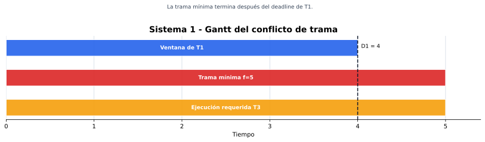
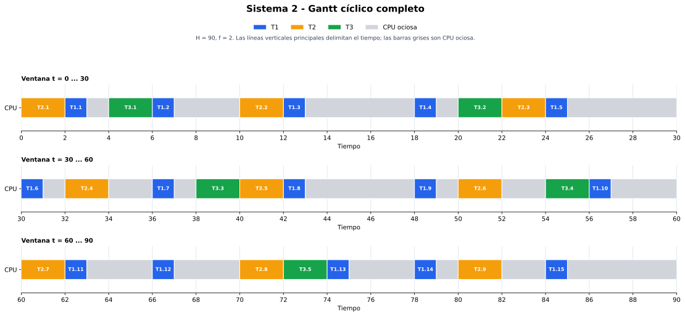
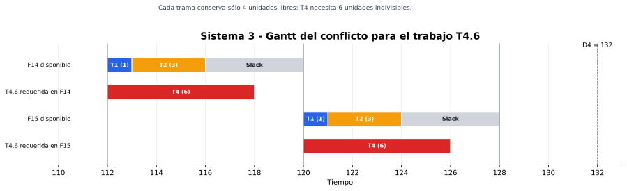
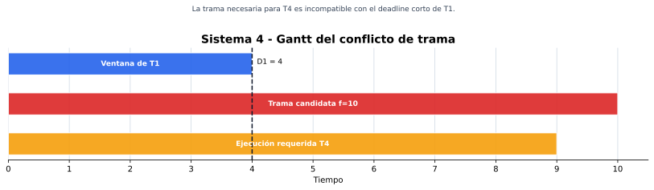

# CESE - Sistemas Operativos de Tiempo Real II

## TP3 - Actividad 01 - Cyclic Scheduling

## 1. Alcance y supuestos

Se consideran tareas periódicas, independientes, con instante crítico común en `t = 0`, sin bloqueos ni sobrecarga del sistema operativo. Para cada tarea se cumple `D_i = T_i` y `C_i` representa su tiempo de ejecución de peor caso (WCET).

La planificación se realiza mediante un ejecutivo cíclico sin fragmentación de trabajos. El hiperperíodo o ciclo mayor es:

$$
H = \operatorname{mcm}(T_1,T_2,\ldots,T_n)
$$

El factor de uso es:

$$
U = \sum_{i=1}^{n}\frac{C_i}{T_i}
$$

Para que un tamaño de trama `f` pueda actuar como período secundario debe cumplir:

1. `f >= max(C_i)`, para que cada trabajo quepa completo en una trama.
2. `f` debe dividir exactamente al hiperperíodo `H`.
3. Para toda tarea `i` debe cumplirse:

$$
2f-\operatorname{mcd}(T_i,f)\le D_i
$$

Estas condiciones permiten seleccionar tramas candidatas, pero todavía debe construirse una tabla estática cuya carga no supere `f` en ninguna trama. 

### Convención de los diagramas de Gantt

Los diagramas usan el tiempo en el eje horizontal. Cada barra coloreada representa el intervalo durante el cual un trabajo ocupa la CPU: azul para T1, naranja para T2, verde para T3 y rojo para T4. Los espacios sin barra corresponden a CPU ociosa. En los sistemas no planificables se muestra el conflicto que impide construir un Gantt de ejecución válido.

### Criterio de prioridades

En un ejecutivo cíclico la tabla estática decide qué se ejecuta y no existe arbitraje dinámico entre tareas. De todos modos, para cumplir la consigna se asigna una prioridad nominal inversamente proporcional al período: menor período implica mayor prioridad. Se usa `P1` como prioridad más alta.

## 2. Resumen de resultados

| Sistema | Factor de uso | Hiperperíodo `H` | `mcd(T_i)` | Período secundario final | Resultado |
| :--: | --: | --: | --: | :--: | :-- |
| 1 | `0,9000` (90,00 %) | 20 | 1 | No existe | No planificable sin fragmentación |
| 2 | `0,4778` (47,78 %) | 90 | 2 | `f = 2` | Planificable |
| 3 | `0,7977` (79,77 %) | 1320 | 1 | No existe; `f = 8` falla al construir la tabla | No planificable sin fragmentación |
| 4 | `0,9000` (90,00 %) | 120 | 1 | No existe | No planificable sin fragmentación |

> Un factor de uso menor que 1 es necesario, pero no suficiente, para un ejecutivo cíclico sin fragmentación.

## 3. Sistema 1

### 3.1 Datos y prioridades

| Prioridad | Tarea | `C` | `T = D` | Utilización |
| :--: | :--: | --: | --: | --: |
| P1 | T1 | 1 | 4 | `1/4 = 0,25` |
| P2 | T2 | 2 | 5 | `2/5 = 0,40` |
| P3 | T3 | 5 | 20 | `5/20 = 0,25` |

$$
U_1=\frac14+\frac25+\frac5{20}=0,90
$$

$$
H_1=\operatorname{mcm}(4,5,20)=20
$$

### 3.2 Test de garantía

Como `max(C_i) = 5`, sólo deben examinarse los divisores de 20 mayores o iguales que 5: `f in {5, 10, 20}`.

| `f` | Comprobación que falla | Resultado |
| --: | :-- | :--: |
| 5 | Para T1: `2(5) - mcd(4,5) = 9 > D1 = 4` | Rechazado |
| 10 | Para T1: `20 - mcd(4,10) = 18 > 4` | Rechazado |
| 20 | Para T1: `40 - mcd(4,20) = 36 > 4` | Rechazado |

No existe un período secundario válido. Aunque el procesador sólo se utiliza al 90 %, T3 necesita cinco unidades continuas y obliga a usar una trama demasiado grande para el plazo de T1.

### 3.3 Gantt de la incompatibilidad

La primera ventana de T1 termina en `t = 4`, mientras que la trama mínima necesaria para contener T3 terminaría en `t = 5`:



| Intervalo | `[0,4)` | `[4,5)` |
| :-- | :--: | :--: |
| Ventana de T1, `D1 = 4` | Disponible | Fuera del plazo |
| Trama mínima, `f = 5` | Trama F0 | Trama F0 |

Por lo tanto, no puede dibujarse un Gantt de ejecución cíclica válido para este sistema bajo los supuestos adoptados.

## 4. Sistema 2

### 4.1 Datos y prioridades

| Prioridad | Tarea | `C` | `T = D` | Utilización |
| :--: | :--: | --: | --: | --: |
| P1 | T1 | 1 | 6 | `1/6 = 0,1667` |
| P2 | T2 | 2 | 10 | `2/10 = 0,20` |
| P3 | T3 | 2 | 18 | `2/18 = 0,1111` |

$$
U_2=\frac16+\frac2{10}+\frac2{18}=\frac{43}{90}=0,4778
$$

$$
H_2=\operatorname{mcm}(6,10,18)=90
$$

### 4.2 Test de garantía

Los tamaños `f = 2`, `f = 3` y `f = 6` cumplen las tres restricciones. Se elige `f = 2` porque coincide con `mcd(6,10,18)`, minimiza la latencia de despacho y permite que toda tarea quepa en una trama.

| Tarea | `2f - mcd(T_i,f)` con `f = 2` | Plazo | Resultado |
| :--: | --: | --: | :--: |
| T1 | `4 - 2 = 2` | 6 | Cumple |
| T2 | `4 - 2 = 2` | 10 | Cumple |
| T3 | `4 - 2 = 2` | 18 | Cumple |

El ciclo mayor contiene `H/f = 90/2 = 45` tramas.

### 4.3 Diagrama de Gantt del ciclo mayor

El siguiente Gantt representa las 90 unidades del hiperperíodo, dividido en tres paneles para conservar la legibilidad. `Tn.j` identifica el trabajo `j` de la tarea `Tn`. Cada barra comienza en el instante asignado por la tabla cíclica; las barras grises representan tiempo ocioso.



#### Tabla estática completa

Cada celda representa una trama de dos unidades. `-` representa una trama completamente ociosa. Cuando se ejecuta T1 queda además una unidad ociosa dentro de su trama.

| Tramas | Asignación |
| :-- | :-- |
| F0 `[0,2)` - F4 `[8,10)` | `T2.1` · `T1.1` · `T3.1` · `T1.2` · `-` |
| F5 `[10,12)` - F9 `[18,20)` | `T2.2` · `T1.3` · `-` · `-` · `T1.4` |
| F10 `[20,22)` - F14 `[28,30)` | `T3.2` · `T2.3` · `T1.5` · `-` · `-` |
| F15 `[30,32)` - F19 `[38,40)` | `T1.6` · `T2.4` · `-` · `T1.7` · `T3.3` |
| F20 `[40,42)` - F24 `[48,50)` | `T2.5` · `T1.8` · `-` · `-` · `T1.9` |
| F25 `[50,52)` - F29 `[58,60)` | `T2.6` · `-` · `T3.4` · `T1.10` · `-` |
| F30 `[60,62)` - F34 `[68,70)` | `T2.7` · `T1.11` · `-` · `T1.12` · `-` |
| F35 `[70,72)` - F39 `[78,80)` | `T2.8` · `T3.5` · `T1.13` · `-` · `T1.14` |
| F40 `[80,82)` - F44 `[88,90)` | `T2.9` · `-` · `T1.15` · `-` · `-` |

La tabla asigna exactamente 15 trabajos de T1, 9 de T2 y 5 de T3. Todos comienzan después de su liberación y terminan antes de su plazo. En `t = 90` se repite el ciclo mayor.

## 5. Sistema 3

### 5.1 Datos y prioridades

| Prioridad | Tarea | `C` | `T = D` | Utilización |
| :--: | :--: | --: | --: | --: |
| P1 | T1 | 1 | 8 | `0,1250` |
| P2 | T2 | 3 | 15 | `0,2000` |
| P3 | T3 | 4 | 20 | `0,2000` |
| P4 | T4 | 6 | 22 | `0,2727` |

$$
U_3=\frac18+\frac3{15}+\frac4{20}+\frac6{22}
=\frac{1053}{1320}=0,7977
$$

$$
H_3=\operatorname{mcm}(8,15,20,22)=1320
$$

### 5.2 Test de garantía

El único divisor de `H` que satisface `f >= 6` y las restricciones escalares es `f = 8`:

| Tarea | `2f - mcd(T_i,f)` | Plazo | Resultado escalar |
| :--: | --: | --: | :--: |
| T1 | `16 - 8 = 8` | 8 | Cumple |
| T2 | `16 - 1 = 15` | 15 | Cumple |
| T3 | `16 - 4 = 12` | 20 | Cumple |
| T4 | `16 - 2 = 14` | 22 | Cumple |

Sin embargo, no puede construirse la tabla estática sin fragmentar trabajos. El siguiente conflicto basta para demostrarlo:

- Como `T1 = f = 8`, cada trabajo de T1 ocupa una unidad en su trama correspondiente.
- Cada trabajo de T2 tiene una única trama completamente incluida entre su liberación y su plazo.
- El sexto trabajo de T4 se libera en `t = 110`, tiene `C4 = 6` y vence en `t = 132`. Sólo podría ubicarse en F14 `[112,120)` o F15 `[120,128)`.
- F14 ya debe contener T1 y el trabajo de T2 liberado en `t = 105`; F15 debe contener T1 y el trabajo de T2 liberado en `t = 120`.
- En cualquiera de ellas la carga sería `C1 + C2 + C4 = 1 + 3 + 6 = 10 > f = 8`.

### 5.3 Gantt del conflicto

El gráfico compara la capacidad disponible en F14 y F15 con el tiempo continuo requerido por T4.6:



| Trama | Intervalo | Carga forzada | Espacio restante | ¿Cabe T4 (`C4 = 6`)? |
| :--: | :--: | :-- | --: | :--: |
| F14 | `[112,120)` | `T1 (1) + T2 (3)` | 4 | No |
| F15 | `[120,128)` | `T1 (1) + T2 (3)` | 4 | No |

No existe un Gantt cíclico válido con trabajos indivisibles. Para hacerlo viable habría que fragmentar al menos alguna tarea o cambiar sus parámetros temporales.

## 6. Sistema 4

### 6.1 Datos y prioridades

| Prioridad | Tarea | `C` | `T = D` | Utilización |
| :--: | :--: | --: | --: | --: |
| P1 | T1 | 0,5 | 4 | `0,1250` |
| P2 | T2 | 1 | 5 | `0,2000` |
| P3 | T3 | 2 | 10 | `0,2000` |
| P4 | T4 | 9 | 24 | `0,3750` |

$$
U_4=\frac{0,5}{4}+\frac15+\frac2{10}+\frac9{24}=0,90
$$

$$
H_4=\operatorname{mcm}(4,5,10,24)=120
$$

### 6.2 Test de garantía

Se necesita `f >= max(C_i) = 9`. El menor divisor posible de `H` es entonces `f = 10`, pero falla inmediatamente para T1:

$$
2(10)-\operatorname{mcd}(4,10)=20-2=18>D_1=4
$$

Todo divisor mayor produce un lado izquierdo aún mayor para T1, por lo que no existe período secundario válido.

### 6.3 Gantt de la incompatibilidad

El Gantt muestra que la trama candidata requerida por el WCET de T4 se extiende mucho más allá del plazo de la primera instancia de T1:



| Intervalo | `[0,4)` | `[4,10)` |
| :-- | :--: | :--: |
| Ventana de T1, `D1 = 4` | Disponible | Fuera del plazo |
| Trama mínima candidata, `f = 10` | Trama F0 | Trama F0 |

No puede construirse un Gantt cíclico válido sin fragmentar T4 o modificar los requisitos temporales.

## 7. Configuración de FreeRTOS para Cyclic Scheduling

FreeRTOS no genera por sí mismo una tabla cíclica fuera de línea. La implementación propuesta utiliza una única tarea despachadora que ejecuta funciones no bloqueantes según la tabla del ciclo mayor. Para el Sistema 2, la tarea despachadora avanza una trama cada dos unidades de tiempo y reinicia el índice después de 45 tramas.

Configuración relevante en `FreeRTOSConfig.h`:

```c
#define configUSE_PREEMPTION            0
#define configUSE_TIME_SLICING          0
#define configUSE_TICKLESS_IDLE         0
#define configMAX_PRIORITIES            3
#define configTICK_RATE_HZ              1000
```

Esqueleto del despachador:

```c
static void vCyclicExecutive(void *argument)
{
    TickType_t last_wake = xTaskGetTickCount();
    size_t frame = 0U;

    for (;;) {
        execute_frame(frame);       /* Tabla estática F0 ... F44. */
        frame = (frame + 1U) % 45U;
        vTaskDelayUntil(&last_wake, FRAME_TICKS);
    }
}
```

Consideraciones de implementación:

- `FRAME_TICKS` debe representar exactamente el período secundario `f` en la unidad elegida.
- Las funciones ejecutadas dentro de una trama no deben bloquear, llamar a `vTaskDelay()` ni esperar indefinidamente por recursos.
- Debe medirse el WCET real y comprobar que la suma de ejecuciones asignadas a cada trama no supere `f`.
- Las interrupciones deben ser breves y su interferencia debe incluirse en el presupuesto temporal.
- Los Sistemas 1, 3 y 4 no se vuelven planificables mediante una opción de FreeRTOS: requieren fragmentación explícita o rediseño temporal.

## 8. Conclusión

El Sistema 2 admite un ejecutivo cíclico sin fragmentación con `H = 90` y `f = 2`. Los Sistemas 1 y 4 no poseen una trama que satisfaga simultáneamente WCET y plazos. En el Sistema 3, `f = 8` supera las restricciones escalares, pero la asignación estática es imposible por el conflicto entre T1, T2 y el sexto trabajo de T4. Por ello, sólo el Sistema 2 tiene un Gantt cíclico válido bajo los supuestos establecidos.

